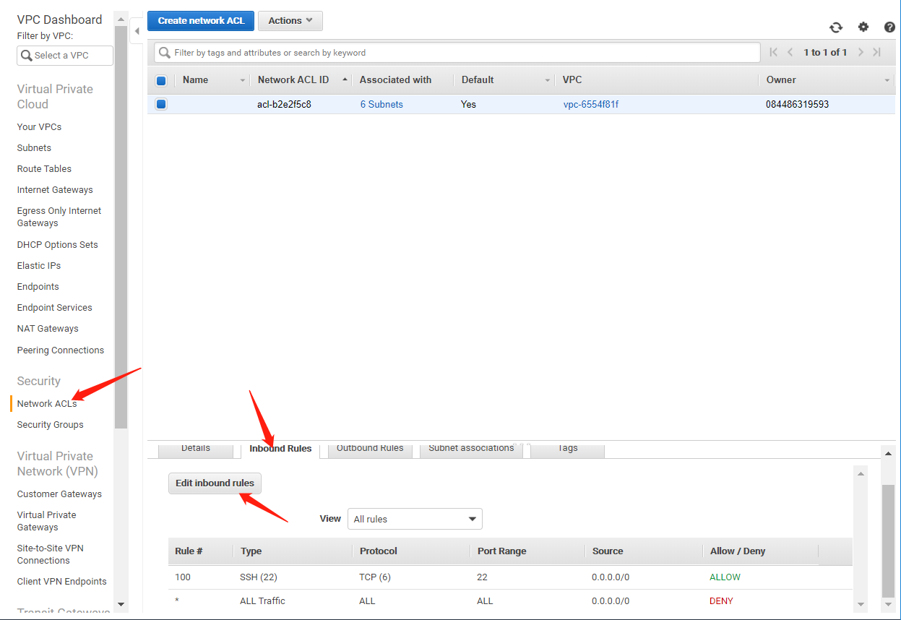

# Basic Concepts

**High Availability**: If you upload your file on a cloud, then every device with an internet connect will be able to access this file. This is high availability.

**Fault Tolerant:** If you only have a file on your computer and your computer hard drive fails, then this file is gone. So, the system that was in place didn't account for that fault being the fault of your hard drive. But if the file is uploaded in the cloud and it's backed up on multiple services, then that file can be corrupt.

**On-Premise**: 如果一个公司并没有使用cloud，则意味着该公司正在使用on-premise service。这也意味着该公司将他们的数据或代码，或者当用户使用他们的软件，这些都是发生在该公司自己的服务器上的。

**Scalability**: As user base grows, you have ability to quickly and easily to add more servers so you can scale up extremely easily.

**Elasticity**: When your user base shrinks, you also have ability to quickly and easily to add more servers so you can scale up extremely easily.

**VPC**: Virtual Private Cloud. \(**A Virtual Private Cloud is your private section of AWS, where you can place AWS resources, and allow/restrict access to them**.\) 为了理解VPC，我们可以用Facebook来做一个类比。例如，Facebook内部有各个用户的个人主页，每个用户可以对自己的主页设置访问权限。

同样的，我们可以将Facebook换成AWS，将homepage换成VPC，如下。用户可以在自己的VPC中部署EC2, RDS等，同时也可以设置隐私权限。

**EC2**: Elastic Cloud. 你可以将EC2想象成一个放在你面前的一台计算机，这台计算机有CPU, OS, Hard Drive, Network Card, Firewall, RAM, etc。这里要说一下，**如果你看到了"instance"或"server"，他们都指的是EC2 server**。

实际上，Netflix是AWS最大的用户，那么Netflix是怎么使用AWS EC2的呢？例如，如果你去了Netflix的主页[https://www.netflix.com/](https://www.netflix.com/)，那么你实际上相当于连接了AWS EC2 instance，且该instance中涵盖了所有与[https://www.netflix.com/](https://www.netflix.com/) 相关的文件、代码。

**RDS**: Database provided by AWS. The usage of RDS is to store customer info. 例如，我们在Netflix上申请了一个账号，那么这个账号的信息就会被存入Netflix的VPC下面的RDS。当用户想要获取账号信息时，就能直接通过EC2获得。

我们知道，对于Netflix这样的网站来说，在一天中的某一特定时间段内会有很多用户。例如晚上8点钟。这时候，如果Netflix公司使用了on-premise server，那么很有可能会造成该server的宕机。但是，如果Netflix公司使用了AWS，那么随着该时段内的活跃用户量的增加，AWS会自动添加一个新的EC2，以防服务器宕机，从而所有用户可以同时访问RDS，这也是AWS的scalability的体现：

同理，随着午夜用户量的减少，AWS也会自动减少EC2的数量，这也是AWS的elasticity的体现：

**综合scalability和elasticity，就是AWS的high availability的体现。**

AWS **Fault Tolerant**的体现：假设现在有一个EC2宕机了，那么，正在使用这个EC2的用户就不能够继续访问Netflix。此时，AWS会将正在使用宕机了的EC2的用户部署到其他可用的EC2上。然后将宕机的服务器移除，然后重开一个EC2，并将之前被部署的用户重新移回新开的EC2上。（一般来说，上述过程只需几分钟）

**S3**: S3 is a storage platform of AWS. S3 is like a large unlimited storage "bucket". 实际上Dropbox就是S3的一种。

如果一个用户想要在Netflix上观看视频，此时发生的事情就是：EC2从S3提取视频数据，将视频数据进行解码或转码然后呈现给用户。\(Amazon EC2 is a good tool for any type of "processing" tasks.

**Availability Zone**: Availability Zone is the geographical zone of where your Data Center was deployed.

