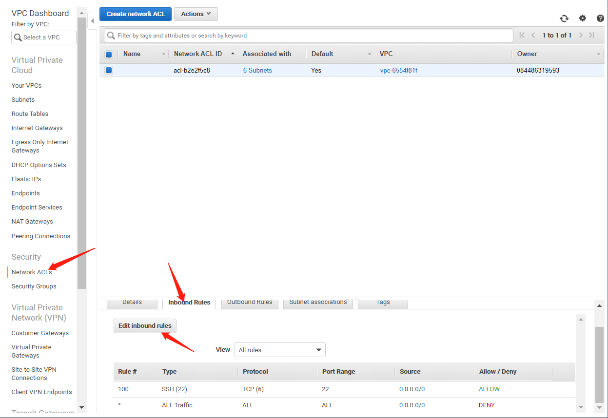

# Section 4. Network Services and Connectivity

## 1. VPC Basics

#### 1.1 VPC \(Virtual Private Cloud\)

类似于Facebook用户的Homepage，我有自己的homepage，我的朋友有他们自己的homepage，每个人只有权力更改自己的homepage。

再举一个家庭网络的例子：如果你家里有网络，那么这个网络就叫做Private network。常见的家庭网络的组成有：

1. Wire: 从街道拉到家内的电线
2. Modem: 是你链接网络的”门“
3. Wire: 这个电线是链接Modem和路由器（Router）的
4. Router/Switch: 是帮助你链接到网络的设备。它能将网络信号导向到网络中的其他设备上，或者通过Modem将网络信号导向到/导回 Internet Service Provider \(ISP\)
5. Local Devices: 例如个人电脑，手机等能连接到网络的设备都是Local Devices。

所以说，如果Modem坏掉，Local Devices和Router就无法连接到ISP。但是Local Devices之间仍然可以通信，因为Router还在工作。

如果Router不工作，那么Local Devices之间失去联系，且无法连接到ISP

在Local Devices和Router之间添加了一个Firewall，Firewall的作用就是识别电脑病毒等有害信息，并将其过滤掉，使得只有安全的信息能被传输到Local Devices上。

#### 1.2 现在我们再来看一下AWS VPC的架构：

1. 首先，我们有若干个**EC2 instance**，它们就相当于上一个案例中的Local Devices（如个人电脑，手机等）。
2. 如果这些EC2 Instance想要访问某个网站，这些访问请求就会进入**Network Access Control List \(NACL\)**，它的功能就相当于一个Firewall，它能让特定的network traffic通过。
3. 一旦通过了，这些请求就进入**Route Table**（相当于上个案例的Router），从而进入**Internet Gateway**（相当于Modem），再进入**Internet** \(or Internet Service Provider, ISP\)。
4. 然后**Internet**会将访问到的信息  通过I**nternet Gateway**和**Route Table**返回给**Network Access Control List \(NACL\)**。过滤之后再传送到每个**EC2 Instance**上。

## 2. Internet Gateways \(IGW\)

IGW是软件和硬件的组合，它为private network提供了访问Internet Service Provider \(ISP\)的路径和通道。**因此，我们必须保证IGW的high availability和redundancy**。

另外，**当你创建了自己的AWS account后，一个VPC就自动生成了。VPC生成后就会有一个IGW被attach到VPC上**：

来到"Your VPCs"下面，你会发现VPC ID与Internet Gateway被Attach到的VPC的ID是一样的。

如果我们将VPC与Internet Gateway之间的连接断开，那么就无法连接到Internet Service Provider了：

注意：**一个VPC一次只能attach一个Internet Gateway（A VPC can only attach one Internet Gateway at a time）**。

#### 2.1 Create an Internet Gateway \(IGW\)

## 3. Route Tables \(RTs\)

### 3.1 Route Table Definition:

A Route Table contains **a set of rules**, called **routes**, that are used to **determine where network traffic is directed**.

还记得AWS VPC的架构：

#### 3.1.1.

我们进入AWS来查看一下Route Table：Click on "Route Tables" --&gt; take a look at VPC ID --&gt; Click on "Routes" tag down below:

在"Routes"这一栏，我们有两个Routes，第一个是ip address CIDR notation for our default VPC. So when the VPC was created, it assigned this IP range to the VPC and if we take a look at the Target, the Target is "local". This indicates that if the destination IP address falls within this IP CIDR range, then the communication should be kept locally within our VPC.

第二个Route Destination是0.0.0.0/0。它意味着，if any communications that's not destinated specifically for our local subnet should be directed to this default destination, which is our internet gateway. 如果有任何通信不以当地子网为终点，那么该通信就要被定向到该默认终点，也就是172.31.0.0/16这里。那就是说，随着通信信息通过VPC，一旦它再次通过route table，route table判断  如果该信息要去往"local" \(i.e. 172.31.0.0/16\)，那就放行；如果要去往其他终点，那就会被定向到我们的Internet Gateway之外，然后回到Internet Service Provider。例如，**如果信息传输的终点是173.31.0.0/16（local）那么该信息就只在这一范围内的子网中传递，而不上传Internet；如果信息传输终点是其他，如0.0.0.0/0，那么该信息就会通过Internet Gateway传到Internet**。

#### 3.1.2.

**思考：如果我们将Internet Gateway从VPC上detach下来会怎样？（如下图）**

这种情况就非常像，我们家里的Modem坏掉了，所有家中的设备之间可以正常通信，但是不能连接到Internet Service Provider。

我们来实际操作一下：Click "Internet Gateways" --&gt; Detach "igw" gateway from VPC:

（如果你遇到了类似"you've mapped to public addresses"的问题，可以尝试重新登陆，并重新加载VPC）

#### 3.1.3.

然后，我们的Route Table与Internet Gateway之间虽然还有联系，但因为Internet Gateway已经与Internet断开了，所以所有的VPC都断开了与Internet的链接。你会发现现在的Internet Gateway指向了一个”blackhole“：（因为0.0.0.0/0是连接到Internet上的，现在指向了blackhole就意味着Internet与Internet Gateway之间的联系断掉了）。

#### 3.1.4.

还记得我们有两个Internet Gateway么，现在"igw-46392a3e" gateway坏掉了，我们能不能用我们自己创建的"EssentialsIGW"（也就是"igw-0ee3ac3c6dc7dccde"）gateway来建立VPC与Internet之间的联系呢？试一下：（如果attach  "EssentialsIGW"后，Route Tables下的Routes下的Status从"blackhole"变成了"Active"，说明可以用新建的Internet Gateway；否则则不能）

Click "Internet Gateways" --&gt; Right Click on "detach" of "EssentialsIGW" gateway --&gt; Click on "Attach to VPC" --&gt; Select VPC "vpc-6554f81f" \(Your VPC ID may be different from mine\) --&gt; Click "Attach" button, then the State will turn to "attached":

此时我们返回"Route Tables" --&gt; "Routes"，发现0.0.0.0/0的State还是"blackhole"。为了能用新建的“EssentialsIGW” gateway来控制当前的VPC，我们要Click "Edit routes" button --&gt; Click "Cross" icon --&gt; Click "Add route" button --&gt; Type "0.0.0.0/0" in "Destination" --&gt; Type and search IGW \(i.e. EssentialsIGW\) --&gt; Click "Save routes" button

这时候，我们就用"EssentialsIGW" gateway替换了之前默认的gateway。

再看一眼Route Tables下面的Routes State，发现原来的"blackhole"变成了“Active”，说明新的Gateway 被成功attach到当前VPC上了：

总结一下：

1. 默认的VPC会自带一个**main route table**
2. 在一个VPC中，可以有多个active的route table，但是能有一个active（attached）的Gateway
3. 当一个route table被有子网（subnet）时，该route table不能被删除

## 4. Network Access Control List \(NACLs\)

### 4.1 Definition

简单点来说，NACL就是可有可无的一层，它的功能类似于防火墙（Firewall），是用来控制特定网络流量进出子网的。\(An optional layer of security for your VPC that acts as a firewall for controlling traffic in and out of one or more subnets.\)

### 4.2. How NACL works and Basic Operations:

#### 4.2.1. 

Click "Network ACLs" --&gt; Check VPC box --&gt; Click on "inbound Rules". 要注意的是，**NACL is stateless, you must create inbound and outbound rules**. NACL没有状态，我们只能通过创建出入规则来控制network traffic的进出。

被创建的NACL rule可以抽象在Route Table和EC2之间，它控制着network traffic的进出（如下图）。另外要说的一点是，每当有一个NACL，它就会自带两个Rule（如上图的**Rule \#**），一个是Rule \# 100（也可能是别的号）。第二个是default rule（Rule \*），它能够访问所有其他的rule，且这个Rule被Deny了。也就是说，所有不属于Rule \# 100的traffic都会被Deny掉。

#### 4.2.2. 规定NACL Inbound Rules

Click "Edit inbound rules" --&gt; 你会看到（下面第二幅图）Rule \# 100允许了所有的traffic进入 --&gt; Set "Type" to "SSH" --&gt; Click "Save"

现在，你的新 Rule就只允许SSH的信号的进入了：

#### 4.2.3. 如何Deny一个Rule呢？

Click on "Network ACLs" --&gt; Click on "Inbound Rules" --&gt; Click on "Edit inbound rules" --&gt; Type "Rule \#" as "90" --&gt; Set "Type" as "SSH" --&gt; "Allow/Deny" as "DENY" --&gt; Click on "Save":

然后就能看到我们新建了一个用来Deny SSH的Rule \# 90。但是Rule \# 90和\# 100 都是用来Allow/Deny Inbound的traffic。如果我们想对Outbound traffic进行限制，就要Click "Outbound" tag（先别点）。在"Inbound Rules"下，我们先将刚刚的Rule \# 90去掉，并添加Rule \# 100：Click "Edit inbound rules" --&gt; click "cross" icon to remove Rule \# 90 --&gt; Click "Save" --&gt; Click "Edit inbound rules" --&gt; click "add rules" --&gt; Type "Rule \#" as "100" --&gt; select "Type" as "ALL Traffic" --&gt; Set "Allow/Deny" as "ALLOW" --&gt; Click "Save": （最后得到下面第二张图）

Click "Outbound rules" tag --&gt; "Add outbound rules" --&gt; Select "Type" as "Custom TCP Rule" --&gt; "Port Range" "1024-65535" --&gt; Click "Save"：

我们允许“1024-65535”这个范围的端口的原因是，即使SSH信号被允许从port 22进入NACL，但是当该SSH信号 传出NACL时，只能通过一个临时端口（ephemeral port）。临时端口是用来返回临时通讯信号的临时端口。

我们再看一下子网（subnet）：你会发现现在创建了VPC之后，会有6个子网被创建在NACL下。

#### 4.2.4. 创建新的NACL

创建新的NACL：Click "Network ACL" --&gt; Click "Create Network ACL" --&gt; Type "EssentialsNACL" in Name tag --&gt; Select VPC as "vpc-6554f81f" \(Yours may be different from mine\) --&gt; Click "Create"：

你会发现，我们自己创建的NACL下面并没有子网（subnet）。

#### 如何向"EssentialsNACL"添加subnet呢？

Click "Subnet association" --&gt; Click "Edit subnet associations" Button --&gt; Check the first default subnet --&gt; Click "Edit"：

你会发现，default NACL（acl-b2e2f5c8）中的第一个subnet \(subnet-c4d24cea\)被添加到了EssentialsNACL中。

如果现在再看一下"Inbound Rules"和"Outbound Rules"这两个tag，你会发现，所有的network traffic都不被允许进入或传出EssentialsNACL。

所以，我们要对inbound和outbound的权限进行设置如下：

Click "Inbound Rules" tag --&gt; Click "Edit inbound rules" --&gt; Click "Add Rule" --&gt; Type "100" as Rule \# --&gt; Select "HTTP" as Type --&gt; Click "Save": 

Similarly, do the same thing for Outbound:

Click "Outbound Rules" --&gt; Click "Add outbound rules" --&gt; Click "Add Rule" --&gt; Type "100" as "Rule \#" --&gt; Select "HTTP" as "Type" --&gt; Click "Save"：

现在我们有的两个NACL：

#### 总结一下：

1.  Rules是按照Rule \#从低到高进行评估的
2. 第一个应用于流量类型Rule将立即被应用，无视其后的任何规则
3. default NACL允许所有的network traffic进入default subnet
4. 任何新的NACL都默认DENY所有的network traffic
5. 一个subnet一次只对应一个NACL，但可以更改对应的NACL
6. 一个NACL可以allow 或 deny掉network traffic 进入subnet。一旦进入subnet，其他AWS资源（例如EC2 instance）都会有额外的安全层（或安全组）

## 5. Subnets

### 5.1. Definition

A subnet is a sub-section of a network. A subnet includes all the computers in a specific location. Circling back to the _home network_ analogy we used in the VPC Basics lesson, if you think about your ISP \(Internet Service Provider\) being a network, then your home work can be considered a subnet of your ISPs network.

AWS对subnet的定义：当你创建了一个VPC，VPC就横跨在所有当前Region（如North Virginia）内部的Availability Zone上。在创建VPC后， **你可以在每个Availability Zone上添加一个或多个subnet**。每个subnet必须**完全**驻留在一个可用区域内，不能跨Region。

看一下图：我们看到，当前Region下有Availability Zone 1（其中有两个subnet，一个subnet1, i.e. EC2 instance；一个subnet3, i.e. RDS） 和Availability Zone 2（其中有两个subnet，一个subnet2, i.e. EC2 instance；一个subnet4, i.e. private）。所以很容易看出，两个EC2之间是通过将信号传输给NACL，然后传给Route Table，再然后分发给其他EC2。

我们再来看一下private 的subnet是如何连接其他设备的：从下图能看出，一个private的RDS是不能与Internet Service Provider（Internet）进行交流的。实际上，**所有的private都不与Internet Service Provider进行交流。private只通过Route Table与其他public/private设备（or Subnet）进行交流。**

### 5.2. Operations for Subnets

#### 5.2.1.

最初的Route Table中，并没有指定相关联的Subnet（"Explicit subnet associate"为空）。如果我们没有明确声明某个Subnet要与某个Route Table关联的话，那么该Subnet就默认与Main Route Table相关联（你会看到”Main“下面是”Yes“）

现在我们新建一个Route Table：Click "Create route Table" --&gt; Type "EssentialsRT" as "Name tag" --&gt; Select "vpc-6554f81f" as VPC --&gt; Click "Create"

你会发现（下面第二个图），我们的"EssentialsRT"并没有和”Main Route Table“关联。”EssentialsRT”也没有和任何Route Table进行连接，这意味着与“EssentialRT”相连的任何subnet都将无法连接到Internet Service Provider \(Internet\)。“EssentialsRT”就相当于下图中，右边的Route Table：

#### 5.2.2.

为“EssentialsRT” 这个Route Table添加subnet：Click to select "EssentialRT" --&gt; Click "Subnet Associations" --&gt; Click "Edit subnet associations" --&gt; Check the first two subnets "subnet-c4d24cea
" and "subnet-05db4862" \(Yours may be different\) --&gt; Click "Save"：

然后就会看到被选中的两个subnet被添加到了当前“EssentialsRT”这个Route Table中了。

#### 5.2.3.

我们完成了右半部分的设置，现在我们要对左半部分进行设置。左半部分有一个与Internet Gateway相连的Route Table，且该Route Table下面有两个subnet，一个是EC2 Instance一个是private的RDS：

我们点击默认的Route Table（rtb-5ec7ec21）--&gt; Click "Subnet Associations" --&gt; Click "Edit subnet associations" --&gt; Check the rest 4 subnets \(i.e. "subnet-ac4c6fe6
", "subnet-05ad0a3b
", "subnet-11c9554d
", "subnet-58114457"\) --&gt; Click "Save"：

现在我们就将剩下的4个subnet连接到了默认的Route Table \(rtb-5ec7ec21\)上，现在的结构如下图：

### 5.3. 总结一下：

1. 默认的VPC会被自动创建一个subnet
2. subnet必须要与一个Route Table相连
3. public subnet一定有一条连接Internet Service Provider的路径
4. private subnet没有连接Internet Service Provider的路径
5. subnet一定位于某个Availability Zone之内

最后，我们将6个subnet命名：我们Check "subnet-05ad0a3b" --&gt; Click "Route Table" --&gt; If it has an Internet Gateway （见下图一）, we'll call it "Public Subnet 1" \(or 2, 3, 4\). If it doesn't （见下图二）, we'll call it "Private Subnet 1" \(or 2\)。

最后完成所有subnet的命名如下：

## 6. Availability Zones

### 6.1. Definition of Availability Zone

_AWS definition_: When you create a VPC, **it spans all of the Availability Zones in the Region**. After creating a VPC, you can add **one or more subnets in each Availability Zone**. Each subnet must reside entirely within one Availability Zone and cannot span zones.

_**Simplified Definition**_: Any AWS resource \(like EC2, RDS\) must be placed in a VPC subnet. Any given subnet must located in an Availability Zone. You can utilize multiple Availability Zones to create redundacy in your architecture. This is what allows for High Availability and Fault Tolerant Systems.

**Availability zones are distinct locations that are engineered to be isolated from failures in other Availability Zones. By launching instances in separate Availability Zones, you can protect your applications from the failure of a single location.**

我们从下图来看一下Availability Zone是如何工作的：当Availability Zone 1及其内部的subnet被创建后，会在Availability Zone 2对Availability Zone 1进行备份，但是Availability Zone 2并不会连接到NACL。

当Availability Zone 1宕机，Availability Zone 2就会自动建立与Route Table之间的联系，断开Availability Zone 1与Route Table的联系

### 6.2. 什么是High Availability，Fault Tolerant

## 7. Exam:

